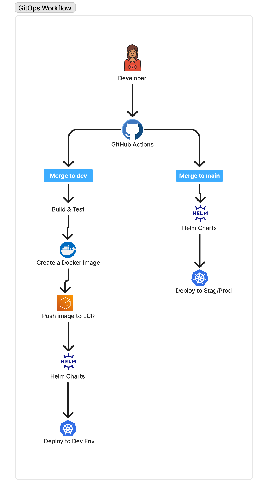

# 🚀 GitOps Helm Deployment with GitHub Actions, ECR, and kOps

This project demonstrates a **GitOps-style CI/CD pipeline** using:

- 🐳 Docker
- ☸️ Kubernetes (kOps)
- 📦 Helm
- ⚙️ GitHub Actions
- ☁️ AWS ECR
- 🌐 NGINX Ingress + DNS

---

## 📌 Architecture Overview

<div align="center">  </div>

### Flow Summary

### 🔹 Dev Branch (`dev`)

1. Developer pushes code
2. GitHub Actions:
   - Build Docker image
   - Push to AWS ECR
   - Deploy to **Dev environment** using Helm

### 🔹 Main Branch (`main`)

1. Code merged to `main`
2. GitHub Actions:
   - Deploy using Helm
   - Release to **Stage/Prod environment**

---

## ⚙️ CI/CD Pipeline

### 🔨 Build Stage

- Build Docker image
- Tag with GitHub run number
- Push to ECR

```bash
IMAGE=<account>.dkr.ecr.<region>.amazonaws.com/repo:<run_number>
```

---

### 🚀 Deploy Stage (Helm)

```bash
helm upgrade --install web ./helm/dev-chart \
  --namespace dev \
  --create-namespace \
  --set image.repository=$IMAGE_REPO \
  --set image.tag=$IMAGE_TAG
```

---

## 🌐 Environments

| Environment | Branch | Namespace | Domain                |
| ----------- | ------ | --------- | --------------------- |
| Dev         | `dev`  | `dev`     | dev.lynasovann.site   |
| Stage       | `main` | `stage`   | stage.lynasovann.site |

---

## 🔐 AWS ECR Authentication

Two approaches:

### ⚠️ Current Implementation

This project currently uses `imagePullSecrets` to authenticate with ECR.

### ✅ Recommended (Production)

Use IAM roles attached to kOps nodes to allow Kubernetes to pull images from ECR without managing secrets.

---

## 🌍 Ingress Setup

NGINX Ingress routes traffic based on host:

```yaml
host: dev.lynasovann.site   → dev namespace
host: stage.lynasovann.site → stage namespace
```

---

## 📦 Helm Configuration

### values.yaml

```yaml
image:
  repository: ""
  tag: ""
```

---

### Deployment Template

```yaml
image: "{{ .Values.image.repository }}:{{ .Values.image.tag }}"
```

---

## 🔧 Prerequisites

- Kubernetes cluster (kOps)
- kubectl configured
- Helm installed
- AWS CLI configured
- ECR repository created
- NGINX Ingress Controller installed

---

## 🔍 Debugging

### Check Pods

```bash
kubectl get pods -A
```

### Check Ingress

```bash
kubectl get ingress -A
```

### Describe Issue

```bash
kubectl describe pod <pod>
```

### Test Routing

```bash
curl -H "Host: dev.lynasovann.site" http://<ELB-DNS>
```

---

## What I am improving

- Use **same Helm chart** for all environments
- Separate via:
  - namespace
  - values files

- Avoid recreating secrets in CI
- Prefer **IAM roles over static credentials**
- Use **Helm over kubectl apply**

---

## Future Improvements

- 🔐 Add HTTPS (cert-manager + Let’s Encrypt)
- 📊 Add monitoring (Prometheus + Grafana)
- 🔁 Blue/Green or Canary deployments

---

## 👨‍💻 Author

**Sovann Lyna**
DevOps Engineer (Learning → Building → Scaling)

---

## ⭐️ Summary

This project demonstrates a **real-world DevOps pipeline**:

```text
GitHub → Build → ECR → Helm → Kubernetes → Ingress → DNS
```

A solid foundation for:

- CI/CD pipelines
- Kubernetes deployments
- GitOps workflows

```

```
